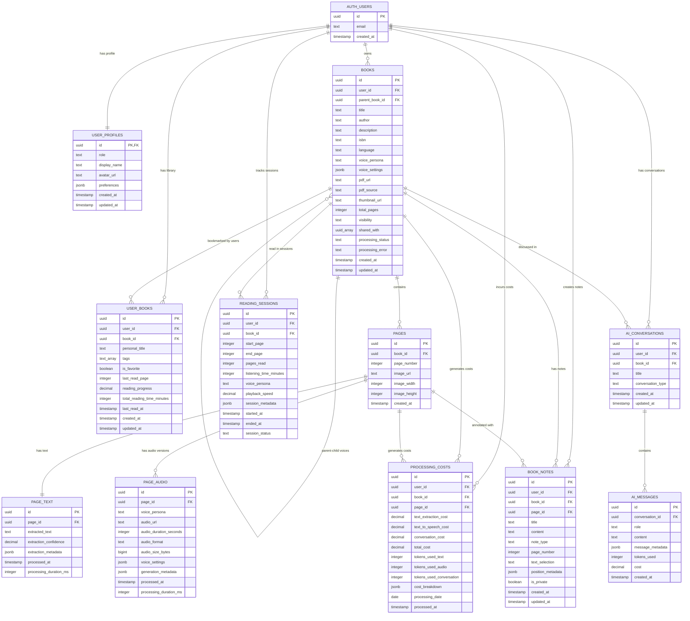

# ReadAI Database ERD (Entity Relationship Diagram)

**Version:** 1.0  
**Date:** 2025-07-24  
**Database:** Supabase (PostgreSQL)

## Overview

This document provides the Entity Relationship Diagram for the ReadAI database schema, showing the relationships between all tables and their key attributes.

## ERD Visualization



## Table Relationships Detailed

### 1. User Management Chain
```
AUTH_USERS (Supabase) 
    ↓ 1:1
USER_PROFILES
    ↓ 1:many
[BOOKS, USER_BOOKS, READING_SESSIONS, PROCESSING_COSTS, BOOK_NOTES, AI_CONVERSATIONS]
```

### 2. Book Hierarchy
```
BOOKS (Parent)
    ↓ 1:many (self-reference)
BOOKS (Children - Voice Personas)
    ↓ 1:many
PAGES
    ↓ 1:1          ↓ 1:many
PAGE_TEXT    PAGE_AUDIO (per voice)
```

### 3. User Library System
```
USER (via AUTH)
    ↓ many:many (through USER_BOOKS)
BOOKS (Bookmark system - no data duplication)
```

### 4. Activity Tracking
```
USER + BOOK
    ↓
READING_SESSIONS (listening behavior)
    ↓
PROCESSING_COSTS (cost aggregation)
```

### 5. Content Enhancement
```
BOOK + USER
    ↓ 1:many
BOOK_NOTES (annotations)

BOOK + USER  
    ↓ 1:many
AI_CONVERSATIONS
    ↓ 1:many
AI_MESSAGES (chat history)
```

## Key Design Patterns

### 1. Cascade Deletion Support
- **User deletion** → All user data deleted automatically
- **Book deletion** → All related pages, text, audio, notes deleted
- **Page deletion** → Related text, audio, notes deleted

### 2. Parent-Child Book Structure
```sql
-- Parent book (original)
books: id=1, parent_book_id=NULL, voice_persona=NULL

-- Child books (voice variations)
books: id=2, parent_book_id=1, voice_persona='british_male'
books: id=3, parent_book_id=1, voice_persona='female_calm'
```

### 3. Bookmark Reference System
```sql
-- User bookmarks parent book
user_books: user_id=123, book_id=1 (parent)

-- User gets access to all voice versions (children)
-- No need to bookmark each voice separately
```

### 4. Multi-Voice Audio Storage
```sql
-- Same page, multiple audio versions
page_audio: page_id=1, voice_persona='default'
page_audio: page_id=1, voice_persona='british_male'  
page_audio: page_id=1, voice_persona='female_calm'
```

### 5. Privacy & Sharing Model
```sql
-- Private book
books: visibility='private', shared_with=[]

-- Public book
books: visibility='public', shared_with=[]

-- Selective sharing
books: visibility='shared_with_users', shared_with=[uuid1, uuid2]
```

## Storage Integration

### Supabase Storage Buckets
```
pdfs/           → books.pdf_url
page-images/    → pages.image_url  
audio-files/    → page_audio.audio_url
thumbnails/     → books.thumbnail_url (public)
avatars/        → user_profiles.avatar_url (public)
```

### File Organization Pattern
```
pdfs/{user_id}/{book_id}/original.pdf
page-images/{book_id}/page_{page_number}.jpg
audio-files/{book_id}/{voice_persona}/page_{page_number}.wav
thumbnails/{book_id}/cover.jpg
avatars/{user_id}/profile.jpg
```

## Security Boundaries

### Row Level Security (RLS) Scope
```
1. USER ISOLATION
   - Users only see their own data
   - Exception: Public/shared books

2. BOOK ACCESS CONTROL  
   - Private: Owner only
   - Public: All authenticated users
   - Shared: Specific users in shared_with array

3. ADMIN PRIVILEGES
   - Full read access to analytics tables
   - No write access to user data
   - Separate admin-only views/functions
```

### Data Access Patterns
```sql
-- Regular user sees:
SELECT * FROM books 
WHERE user_id = auth.uid() 
   OR visibility = 'public'
   OR (visibility = 'shared_with_users' AND auth.uid() = ANY(shared_with))

-- Admin sees (analytics only):
SELECT aggregate_data FROM processing_costs
WHERE EXISTS (
  SELECT 1 FROM user_profiles 
  WHERE id = auth.uid() AND role = 'admin'
)
```

## Performance Optimizations

### Critical Indexes
```sql
-- User data access
idx_books_user_id (user_id)
idx_user_books_user_id (user_id)  
idx_reading_sessions_user_id (user_id)

-- Book relationships
idx_books_parent_book_id (parent_book_id)
idx_pages_book_id (book_id)

-- Public content discovery
idx_books_visibility (visibility)
idx_books_processing_status (processing_status)

-- Analytics queries  
idx_processing_costs_date (processing_date)
idx_reading_sessions_started_at (started_at)
```

### Query Optimization Patterns
```sql
-- Efficient library loading
SELECT b.*, ub.last_read_page, ub.reading_progress
FROM books b
JOIN user_books ub ON b.id = ub.book_id  
WHERE ub.user_id = $1

-- Voice persona discovery
SELECT child.* FROM books child
WHERE child.parent_book_id = $1

-- Page content loading (with prefetch)
SELECT p.*, pt.extracted_text, pa.audio_url
FROM pages p
LEFT JOIN page_text pt ON p.id = pt.page_id
LEFT JOIN page_audio pa ON p.id = pa.page_id AND pa.voice_persona = $2
WHERE p.book_id = $1 AND p.page_number BETWEEN $3 AND $4
```

## Analytics & Reporting Views

### Admin Dashboard Queries
```sql
-- User growth
SELECT DATE_TRUNC('month', created_at) as month, COUNT(*) 
FROM user_profiles 
GROUP BY month

-- Cost breakdown  
SELECT user_id, SUM(total_cost) as total_spent,
       SUM(text_extraction_cost) as ocr_costs,
       SUM(text_to_speech_cost) as tts_costs
FROM processing_costs
GROUP BY user_id

-- Usage patterns
SELECT voice_persona, 
       SUM(listening_time_minutes) as total_minutes,
       COUNT(DISTINCT user_id) as unique_users
FROM reading_sessions
GROUP BY voice_persona
```

---

This ERD provides a comprehensive view of the ReadAI database structure, showing how all components work together to support the multi-user book reading platform with AI-powered features.
